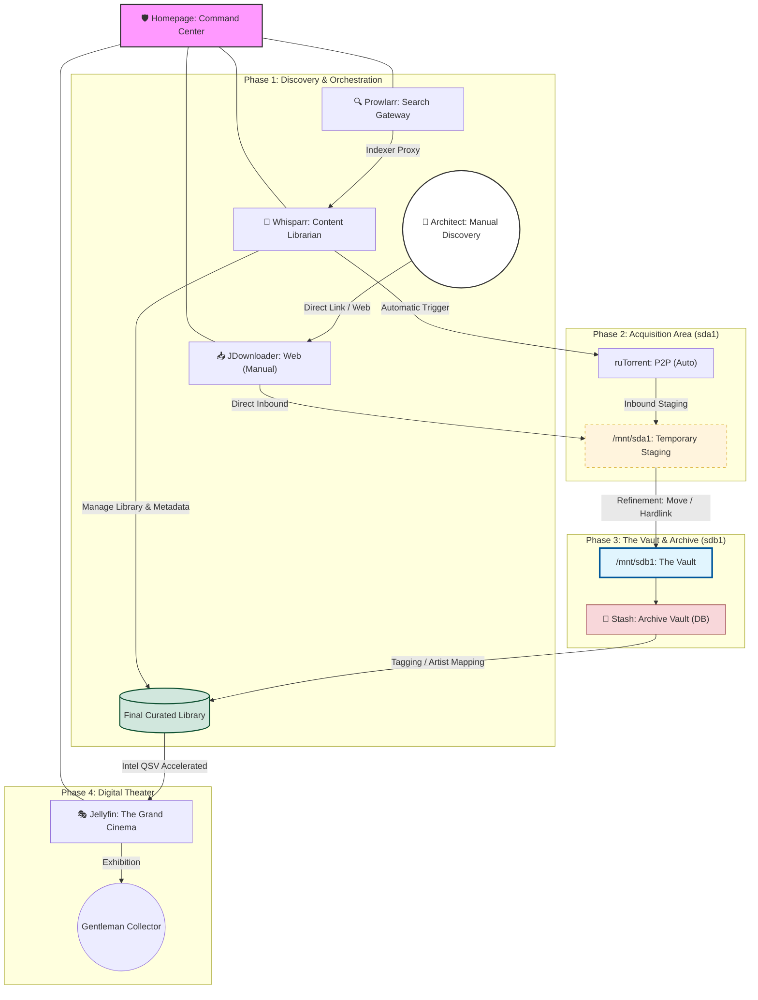

# The Heritage Collection

> A sophisticated system for a more civilized archive.

## 프로젝트 개요

**The Heritage Collection**은 단순한 관리를 넘어선 **'프라이빗 라이브러리 큐레이션'**의 완성을 목표로 하는 고급 미디어 아카이브 시스템입니다. 15년 차 DevOps 엔지니어이자 고급 미디어 큐레이터인 사용자를 위해 설계되었습니다.

## 🗼 System Architecture



## 🚀 Service Endpoints

현재 구축되어 운영 중인 서비스 목록입니다. 통합 대시보드(Homepage)를 통해 모든 서비스에 접근할 수 있습니다.

| Service | Role | Port | Endpoint URL | API Docs |
| :--- | :--- | :--- | :--- | :--- |
| **Homepage** | **Dashboard & Monitoring** | 3000 | `http://192.168.1.108:3000` | N/A |
| **Prowlarr** | Search Gateway (Indexers) | 9696 | `http://192.168.1.108:9696` | `/swagger` |
| **ruTorrent** | Acquisition (Direct) | 8080 | `http://192.168.1.108:8080` | XML-RPC |
| **JDownloader** | Acquisition (Web) | 5800 | `http://192.168.1.108:5800` | MyJD API |
| **Whisparr** | Content Librarian | 6969 | `http://192.168.1.108:6969` | `/api/v3` |
| **Stash** | Archive Vault (DB) | 9999 | `http://192.168.1.108:9999` | `/graphql` |
| **Jellyfin** | Digital Theater | 8096 | `http://192.168.1.108:8096` | `/api-docs` |

## 🔑 API Integration

Homepage 대시보드의 실시간 위젯 기능을 활성화하려면 각 서비스에서 API Key를 발급받아 설정 파일에 등록해야 합니다.

1.  **키 발급:** 위 엔드포인트에 접속하여 `Settings > General > Security > API Key`에서 키를 복사합니다.
2.  **설정 적용:** `homepage/config/services.yaml` 파일을 열어 해당 서비스의 `key:` 필드에 붙여넣습니다.
3.  **재시작:** `podman restart homepage`

## 🔧 환경변수 설정 (Environment Variables)

Homepage 대시보드는 `.env` 파일을 통해 시스템 전체 환경변수를 관리합니다.

### 환경변수 목록

| 환경변수 | 설명 | 대상 서비스 |
|----------|------|-------------|
| `HOMEPAGE_VAR_NAS_IP` | NAS 내부 IP 주소 | 전체 서비스 |
| `HOMEPAGE_VAR_KEY_PROWLARR` | Prowlarr API Key | Prowlarr 위젯 |
| `HOMEPAGE_VAR_KEY_WHISPARR` | Whisparr API Key | Whisparr 위젯 |
| `HOMEPAGE_VAR_KEY_STASH` | Stash API Key | Stash 위젯 |
| `HOMEPAGE_VAR_KEY_JELLYFIN` | Jellyfin API Key | Jellyfin 위젯 |
| `HOMEPAGE_VAR_KEY_TAILSCALE` | Tailscale API Key | Tailscale 위젯 |
| `HOMEPAGE_VAR_DEVICEID_DENEB` | Tailscale 장치 ID (Deneb) | Tailscale 위젯 |
| `HOMEPAGE_VAR_DEVICEID_AGRIAS` | Tailscale 장치 ID (Agrias) | Tailscale 위젯 |
| `HOMEPAGE_VAR_DEVICEID_DECK` | Tailscale 장치 ID (Deck) | Tailscale 위젯 |
| `HOMEPAGE_VAR_DEVICEID_MINI` | Tailscale 장치 ID (Mini) | Tailscale 위젯 |
| `HOMEPAGE_VAR_LATITUDE` | 날씨 위젯 위도 | Open-Meteo 위젯 |
| `HOMEPAGE_VAR_LONGITUDE` | 날씨 위젯 경도 | Open-Meteo 위젯 |

### 설정 방법

1.  **.env 파일 생성:** `.env` 파일은 `.gitignore`에 포함되어 있으므로 수동으로 생성합니다.
2.  **변수 등록:** 위 표의 환경변수와 실제 값을 `.env` 파일에 `KEY=VALUE` 형식으로 등록합니다.
3.  **적용 확인:** `podman restart homepage` 명령어로 컨테이너를 재시작합니다.

## 핵심 인프라 (Core Infrastructure)

*   **OS:** Fedora 43
*   **Runtime:** Podman 5.7.1 (Rootless, Daemonless)
*   **Hardware:** Intel N100 (Chatreey R1)
*   **Storage Strategy:**
    *   **SSD (nvme0n1):** OS, 설정, DB 저장소 (`/home/crong/heritage`)
    *   **HDD 1 (sda1):** Acquisition Area (수집 구역, 신규 다운로드)
    *   **HDD 2 (sdb1):** The Vault (저장고, 최종 아카이브)

## 기술 스택 (The Stack)

*   **Homepage:** 시스템 관제 및 리소스 모니터링
*   **Prowlarr:** 인덱서 통합 관리
*   **ruTorrent:** 메인 수집 엔진 (Autotools 활용)
*   **JDownloader 2:** 직접 다운로드 도구 (JVM 최적화)
*   **Whisparr:** 콘텐츠 자동 정리 (Content Librarian)
*   **Stash:** 프라이빗 DB 관리 (Archive Vault)
*   **Jellyfin:** 4K 스트리밍 (The Grand Cinema, Intel QSV 가속)

## 운영 원칙

*   **IaC (Infrastructure as Code):** 모든 인프라는 `podman-compose`와 Git으로 관리합니다.
*   **Config as Code:** `.gitignore`를 통해 런타임 캐시, 바이너리, 로그를 엄격히 제외하고 순수 설정 파일(Config)만 추적합니다.
*   **Gentlemanly Terminology:** 품격 있는 용어 사용 (예: '프라이빗 큐레이션', '시네마틱 아카이브').
*   **Performance:** I/O Wait 최소화 및 하드링크 우선 적용.

## 🤖 AI Assistant Configuration

프로젝트는 다양한 AI 어시스턴트(GEMINI, Cline, GitHub Copilot)와 함께 작동하도록 구성되어 있습니다.

### 파일 구조

```
.ai/
├── AI.ignore          # 공통 파일 무시 패턴
├── CONTEXT.md         # 프로젝트 기술 사양 및 문맥 (SSoT)
└── RULES.md           # 공통 AI 가이드라인 (최상위 지침)

# 루트 디렉토리 Symbolic Links
GEMINI.md      → .ai/RULES.md    (공통 AI 가이드라인)
.clinerules    → .ai/RULES.md    (Cline 규칙)
.clineignore   → .ai/AI.ignore    (Cline 무시 패턴)
.geminiignore → .ai/AI.ignore    (GEMINI 무시 패턴)
.github/copilot-instructions.md → .ai/RULES.md (GitHub Copilot 규칙)
```

### AI별 참조 구조

- **GEMINI**: `GEMINI.md` → `.ai/RULES.md` + `.ai/CONTEXT.md`
- **Cline**: `.clinerules` → `.ai/RULES.md`, `.clineignore` → `.ai/AI.ignore` + `.ai/CONTEXT.md`
- **Z-AI**: `.ai/RULES.md` + `.ai/CONTEXT.md` (별도 설정 파일 없음)

### 공통 설정 파일

- **[.ai/RULES.md](./.ai/RULES.md)**: 모든 AI가 따르는 최상위 운영 지침
- **[.ai/CONTEXT.md](./.ai/CONTEXT.md)**: 프로젝트 기술 명세 및 구성 (단일 진실 공급원)
- **[.ai/AI.ignore](./.ai/AI.ignore)**: AI가 무시해야 할 파일 패턴
